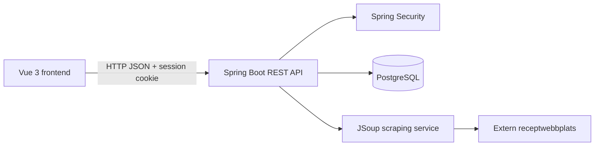
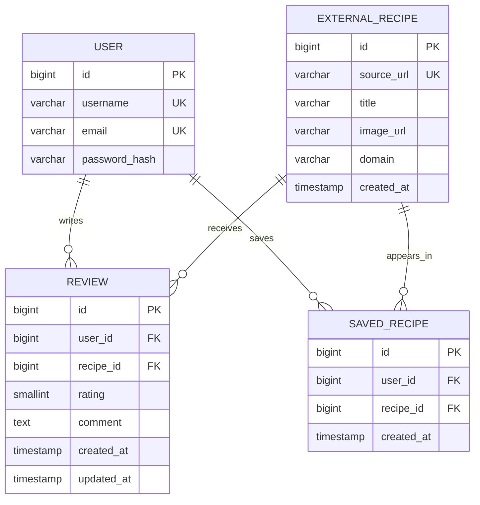
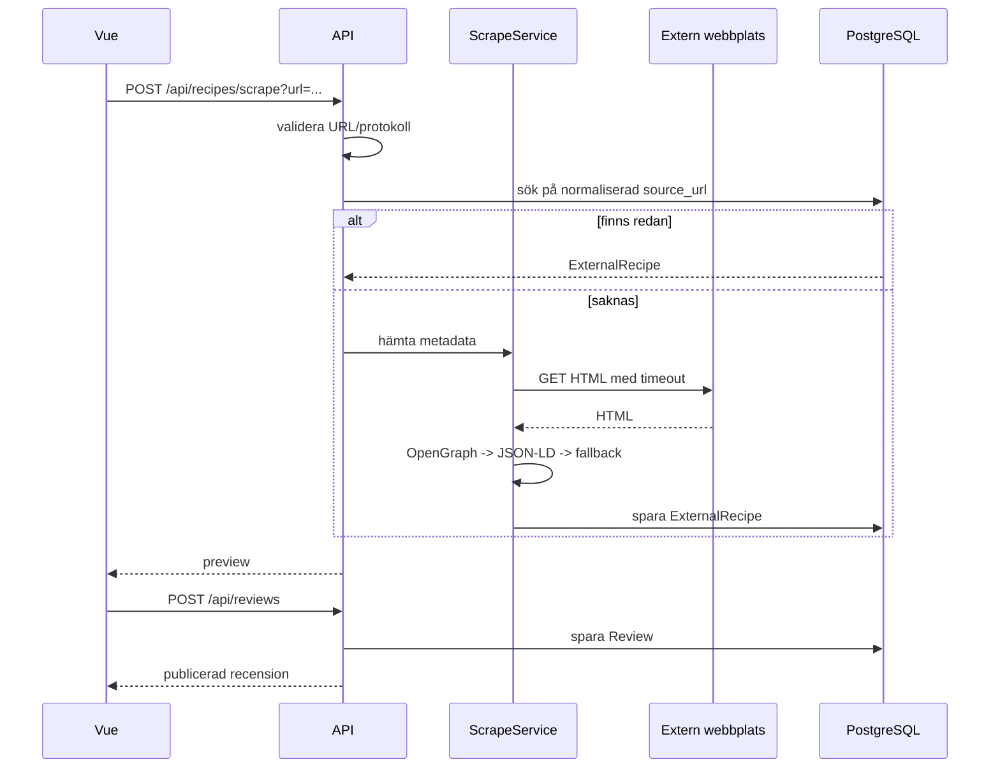

# Arkitektur: receptfeed

## Översikt



Frontendens huvudflöden är `/feed` och `/add-review`. Backendens domäner är användare, externa recept, recensioner och sparade recept. PostgreSQL körs lokalt med Docker och innehåller endast metadata om externa recept.

## Domänmodell



### Constraints

- `source_url` är unik. URL-normalisering bör göras före lookup, till exempel trimning och borttagning av fragment.
- `rating` är ett heltal mellan 1 och 10.
- `(user_id, recipe_id)` är unik i `review`.
- `(user_id, recipe_id)` är unik i `saved_recipe`.
- `password_hash` returneras aldrig i JSON.
- `created_at` sätts på serversidan.
- Feedet använder `updated_at` för en ändrad recension eller `created_at` om produkten ska visa publiceringstid.

## Backendmoduler

```text
backend/src/main/java/com/recipenetwork/backend/
  auth/
    User.java
    UserRepository.java
    AuthController.java
    AuthService.java
    SecurityConfig.java
  recipe/
    ExternalRecipe.java
    ExternalRecipeRepository.java
    RecipeScrapeController.java
    RecipeScrapeService.java
    RecipeMetadataExtractor.java
  review/
    Review.java
    ReviewRepository.java
    ReviewController.java
    ReviewService.java
  feed/
    FeedController.java
    FeedService.java
    FeedItemResponse.java
  saved/
    SavedRecipe.java
    SavedRecipeRepository.java
    SavedRecipeController.java
```

### Ansvarsgränser

- Controller: HTTP, DTO-bindning och statuskoder.
- Service: affärsregler, transaktioner och aktuell användare.
- Repository: databasfrågor och constraints.
- Scrape-service: nätverksanrop, timeout och metadataextraktion.
- DTO:er: API-kontrakt. Returnera inte JPA-entiteter direkt.
- Flyway: enda ägare av databasschema efter migreringen.
- Metadata-cache: `ExternalRecipe` är källan för sparad titel och bild efter första scraping-anropet.

## API-kontrakt

### Scrapa recept

`POST /api/recipes/scrape?url=https://www.ica.se/recept/...`

Svar `200 OK`:

```json
{
  "id": 12,
  "sourceUrl": "https://www.ica.se/recept/example",
  "title": "Exempelrecept",
  "imageUrl": "https://cdn.example/image.jpg",
  "domain": "ica.se",
  "createdAt": "2026-09-20T12:00:00Z"
}
```

Svar `400` används för ogiltig URL eller metadata som inte kan användas. Svar `502` används när den externa sidan inte kan hämtas efter timeout/fel.

### Skapa eller uppdatera recension

`POST /api/reviews`

```json
{
  "recipeId": 12,
  "rating": 8,
  "comment": "Jag bytte grädde mot kokosmjölk."
}
```

- Kräver inloggning.
- Första anropet skapar recension och returnerar `201 Created`.
- Om användaren redan har en recension returnerar POST `409 Conflict`.
- `PUT /api/reviews/{recipeId}` uppdaterar användarens befintliga recension.
- Returnera `401` utan session, `404` om receptet saknas och `422` vid ogiltigt betyg.

### Feed

`GET /api/feed?page=0&size=20`

Publikt läsflöde i MVP. Inloggning krävs endast för att skapa/uppdatera recensioner och spara recept.

```json
{
  "content": [
    {
      "reviewId": 44,
      "username": "elsa",
      "recipe": {
        "id": 12,
        "title": "Exempelrecept",
        "imageUrl": "https://cdn.example/image.jpg",
        "domain": "ica.se"
      },
      "rating": 8,
      "comment": "Jag bytte grädde mot kokosmjölk.",
      "createdAt": "2026-09-20T12:05:00Z",
      "savedByCurrentUser": false
    }
  ],
  "page": 0,
  "size": 20,
  "totalElements": 1
}
```

### Spara recept

`POST /api/recipes/{id}/save`

- Kräver inloggning.
- Returnerar `201 Created` första gången.
- Returnerar `409 Conflict` eller idempotent `200 OK` om receptet redan är sparat. Rekommendation: idempotent `200 OK` för enkel frontend.
- Komplettera med `GET /api/saved-recipes` och `DELETE /api/recipes/{id}/save`.

## Scrapingflöde



Alla HTTP/HTTPS-domäner tillåts i MVP:n. Scrapern ska inte följa redirects till privata IP-adresser. Inför timeout, maxstorlek på svar och tydliga fel. Om titel eller bild saknas används en stabil placeholder-bild, exempelvis en lokal frontend-bild med källans domännamn. Metadata refreshas inte automatiskt i MVP:n. Respektera webbplatsens villkor och robots-regler innan produktion.

## Behörighet

- Anonym användare: läsa feed och externa receptmetadata.
- Inloggad användare: skapa/uppdatera egen review och spara/ta bort recept.
- En användare kan inte skapa två reviews för samma externa recept.
- Review på externa recept är tillåten även om någon annan först sparat/skrapat länken.
- Interna användarskapade recept finns inte i MVP:n. Om de införs senare krävs `InternalRecipe` eller en gemensam `RecipeTarget` med ägarskap; då ska ägaren inte kunna recensera sitt eget recept enligt produktregeln.

## Datamigrering

1. Skapa `users`, `external_recipes`, `reviews` och `saved_recipes` med Flyway.
2. Migrera nuvarande `recipe`-rader till `external_recipes` endast om de har en känd källa; annars lägg dem som seed-data med tydlig källa eller rensa dem.
3. Ta bort den gamla manuella `rating`-kolumnen när review-data används för rating.
4. Byt `spring.jpa.hibernate.ddl-auto` till `validate`.

## Teststrategi

- `RecipeMetadataExtractorTest`: OpenGraph, JSON-LD, saknad metadata och malformed HTML.
- `RecipeScrapeServiceTest`: cache-hit, ny URL, timeout och felstatus.
- `ReviewServiceTest`: ratinggränser, duplicate review, update och auth.
- `SavedRecipeServiceTest`: duplicate save och delete.
- `@WebMvcTest`: statuskoder och JSON-kontrakt.
- Integrationstest med PostgreSQL/Testcontainers: constraints, transaktioner och pagination.
- Frontendflöde: scrape preview → skapa review → feed → save.

## Beslutade MVP-regler

- Feedet är publikt.
- `POST /api/reviews` skapar en recension och returnerar `409 Conflict` om användaren redan har en.
- `PUT /api/reviews/{recipeId}` uppdaterar den befintliga recensionen.
- Alla HTTP/HTTPS-domäner tillåts i MVP:n.
- Sparad metadata refreshas inte automatiskt.
- Saknad bild ersätts av en stabil placeholder-bild.
